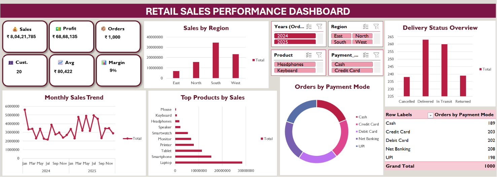

# 📊 Retail Sales Performance Dashboard | Microsoft Excel

An interactive Retail Sales Performance Dashboard built using **Microsoft Excel** to analyze sales performance across different regions, products, payment methods, and delivery statuses. The dashboard provides business insights through dynamic KPIs, Pivot Tables, Pivot Charts, and Slicers, enabling users to explore sales data interactively.

---

## 📷 Dashboard Preview



---

# 📌 Project Overview

This project demonstrates how Microsoft Excel can be used to transform raw sales data into an interactive business dashboard. The dashboard enables users to monitor key business metrics, identify sales trends, compare regional performance, analyze product sales, and evaluate payment methods using interactive filters.

---

# 🎯 Business Objective

The objective of this project is to help business users:

- Monitor overall sales performance
- Track profit and profit margin
- Analyze regional sales
- Identify top-selling products
- Understand customer purchasing patterns
- Monitor delivery status
- Filter reports dynamically using slicers

---

# 🛠️ Tools & Features Used

- Microsoft Excel
- XLOOKUP
- IF Functions
- Data Validation
- Excel Tables
- Pivot Tables
- Pivot Charts
- Slicers
- Conditional Formatting
- Dashboard Design

---

# 📂 Dataset Information

The dashboard is built using a custom retail sales dataset containing approximately **1,000 sales records**.

### Master Tables

- Product Master
- Customer Master
- Location Master
- Salesperson Master
- Payment Mode Master
- Delivery Status Master

### Sales Data Includes

- Order Date
- Product
- Category
- Customer
- City
- State
- Region
- Salesperson
- Payment Mode
- Delivery Status
- Quantity
- Unit Price
- Cost Price
- Total Sales
- Total Cost
- Profit

---

# 📈 Key Performance Indicators (KPIs)

The dashboard provides the following KPIs:

- 💰 Total Sales
- 💵 Total Profit
- 📦 Total Orders
- 👥 Unique Customers
- 📊 Average Order Value
- 📈 Profit Margin

---

# 📊 Dashboard Features

- Interactive KPI Cards
- Monthly Sales Trend
- Sales by Region
- Top Products by Sales
- Orders by Payment Mode
- Delivery Status Overview
- Dynamic Slicers for filtering data
- Professional dashboard layout

---

# 💡 Business Insights

The dashboard helps answer important business questions such as:

- Which region generates the highest sales?
- Which products contribute the most revenue?
- What is the monthly sales trend?
- Which payment methods are most frequently used?
- What percentage of orders are successfully delivered?
- What is the overall profit margin?

---

# 🔄 Dashboard Workflow

1. Created master tables
2. Generated sales dataset
3. Applied Data Validation
4. Used XLOOKUP to retrieve master data
5. Calculated Total Sales, Total Cost, and Profit
6. Cleaned and organized the dataset
7. Built Pivot Tables
8. Created Pivot Charts
9. Designed KPI Cards
10. Connected Slicers for interactive filtering
11. Built the final dashboard

---

# 🧠 Skills Demonstrated

- Data Cleaning
- Data Preparation
- Data Analysis
- Data Visualization
- Dashboard Design
- Business Analysis
- Excel Automation
- XLOOKUP
- Pivot Tables
- Pivot Charts
- Data Validation
- KPI Development

---

# 📁 Project Structure

```
Retail-Sales-Performance-Dashboard-Excel
│
├── Dashboard
│   └── Retail_Sales_Dashboard.xlsx
│
├── Images
│   └── Dashboard.png
│
└── README.md
```

---

# 🚀 Future Enhancements

- Add Year-over-Year comparison
- Add dynamic KPI trend indicators
- Include forecasting charts
- Build a Power BI version of the dashboard
- Automate data refresh using Power Query

---

# 👩‍💻 About Me

**Akanksha Naik**

Aspiring Data Analyst passionate about transforming data into actionable business insights using Excel, SQL, Power BI, and Python.

---

## ⭐ If you found this project useful, consider giving it a star!
